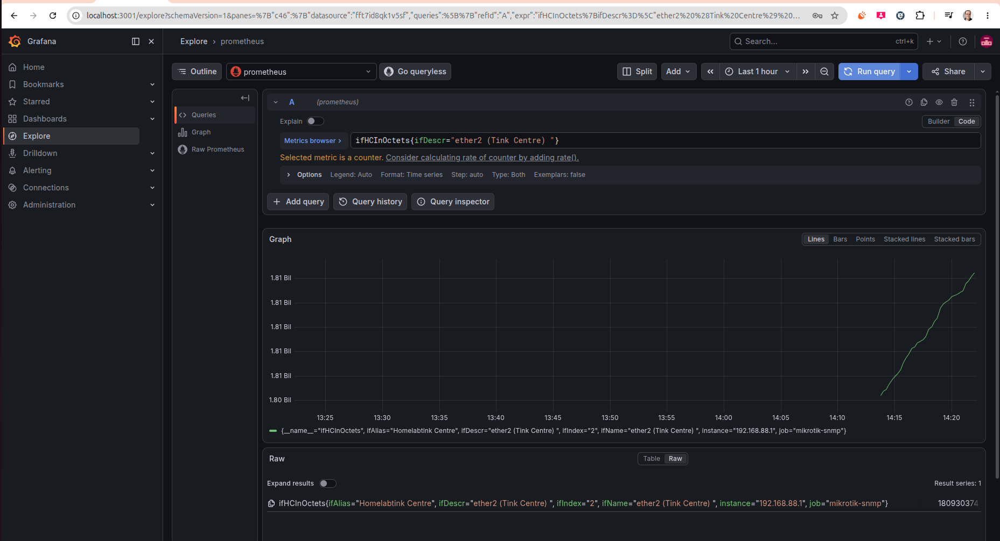

# homelab-monitoring

Laboratório de observabilidade estilo NOC/ISP, rodando via Docker Compose, simulando a operação de monitoramento de uma infraestrutura real: host, rede (MikroTik via SNMP) e um segundo pilar de monitoramento (Zabbix) ao lado do Prometheus/Grafana.

Cada etapa do laboratório é documentada com critérios de estabilidade, evidências de execução e runbooks de troubleshooting real — veja `docs/` e `etapas/`.

## Stack

- **Prometheus**: coleta e armazena métricas (host + rede)
- **Grafana**: visualização em dashboards
- **Node Exporter**: expõe métricas do host (CPU, memória, disco) para o Prometheus coletar
- **snmp_exporter**: traduz métricas SNMP de equipamentos de rede (MikroTik) para o Prometheus coletar
- **MikroTik hEX S**: roteador físico monitorado via SNMP (interfaces, tráfego, disponibilidade)
- **Zabbix** (server + web + PostgreSQL): segundo pilar de monitoramento, com descoberta automática (LLD) de itens via SNMP

## Como rodar

    docker compose up -d

Acessos:
- Grafana: http://localhost:3001 (usuário/senha padrão: admin / admin, troque no primeiro login)
- Prometheus: http://localhost:9090
- Zabbix: http://localhost:8081 (usuário padrão Admin, senha trocada no primeiro acesso — ver nota de segurança abaixo)
- snmp_exporter: http://localhost:9116

> **Nota de segurança:** as credenciais no `docker-compose.yml` (Grafana `admin`/`admin`, Postgres do Zabbix `zabbix`/`zabbix`) são valores padrão para ambiente local de laboratório. Nunca reutilize essas credenciais em um ambiente de produção.

## Configurar Grafana para usar o Prometheus

1. Acesse o Grafana em `localhost:3001`
2. Vá em Connections → Data sources → Add data source
3. Selecione Prometheus
4. URL: `http://prometheus:9090` (nome do serviço no Docker Compose, não `localhost`)
5. Clique em Save & Test

## Monitoramento de rede (MikroTik via SNMP)

O MikroTik hEX S é monitorado por dois caminhos independentes, documentados em `docs/runbooks/snmp-troubleshooting-mikrotik.md`:

1. **Prometheus + snmp_exporter**: job `mikrotik-snmp` em `prometheus/prometheus.yml`, usando o módulo `if_mib` (padrão MIB-II) via `snmp_exporter/snmp.yml`
2. **Zabbix**: host "MikroTik HomeLab" com interface SNMP direta, template "Network Generic Device by SNMP", descoberta automática (LLD) de 75+ itens

## Roadmap deste projeto

- [x] Stack básica (Prometheus + Grafana + Node Exporter)
- [x] MikroTik integrado via SNMP (Prometheus + snmp_exporter)
- [x] Zabbix como segundo pilar de monitoramento, com LLD via SNMP
- [ ] Alertmanager configurado para alertar via webhook
- [ ] Dashboard customizado no Grafana com métricas de rede (MikroTik)
- [ ] Exportar métricas de um dos scripts do `devops-automation-scripts` (ex: healthcheck)

## Como parar e limpar

    docker compose down          # para os containers
    docker compose down -v       # para e apaga os volumes (perde dados salvos)

## Evidência de execução

**Data source do Prometheus conectado com sucesso:**

**Dashboard com métricas reais de CPU e memória do ThinkCentre, capturadas pelo Node Exporter:**

**Integração MikroTik → Prometheus → Grafana, tráfego real da interface ether2:**

## Documentação adicional

- `docs/inventory.md` — inventário vivo de tudo que está sendo monitorado
- `docs/stability-criteria.md` — critérios de estabilidade (SLI/SLO) por componente, com histórico de validação
- `docs/runbooks/` — troubleshooting real documentado (SNMP/MikroTik, Zabbix)
- `etapas/` — registro de cada etapa do plano de evolução do laboratório
- `CHANGELOG.md` — histórico cronológico de mudanças
