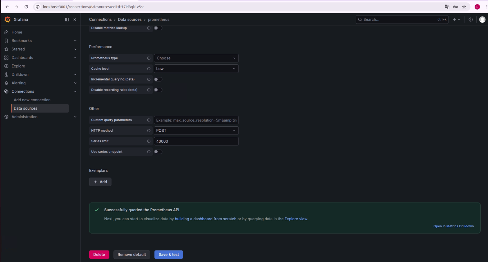
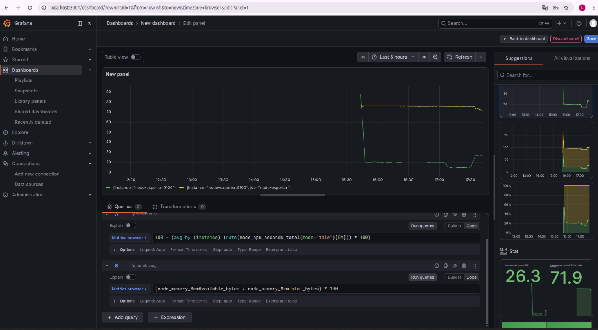

# homelab-monitoring

Stack de observabilidade com Prometheus + Grafana rodando via Docker Compose — a base para monitorar qualquer serviço ou script deste portfólio (ex: os scripts do `devops-automation-scripts`).

## Stack

- **Prometheus**: coleta e armazena métricas
- **Grafana**: visualização em dashboards
- **Node Exporter**: expõe métricas do host (CPU, memória, disco) para o Prometheus coletar

## Como rodar

```bash
docker compose up -d
```

Acessos:
- Grafana: [http://localhost:3000](http://localhost:3000) (usuário/senha padrão: `admin` / `admin`, troque no primeiro login)
- Prometheus: [http://localhost:9090](http://localhost:9090)

## Configurar Grafana para usar o Prometheus

1. Acesse o Grafana em `localhost:3000`
2. Vá em **Connections → Data sources → Add data source**
3. Selecione **Prometheus**
4. URL: `http://prometheus:9090` (nome do serviço no Docker Compose, não `localhost`)
5. Clique em **Save & Test**

## Roadmap deste projeto

- [x] Stack básica (Prometheus + Grafana + Node Exporter)
- [ ] Dashboard customizado com as métricas do host
- [ ] Alertmanager configurado para alertar via webhook
- [ ] Exportar métricas de um dos scripts do `devops-automation-scripts` (ex: healthcheck)

## Como parar e limpar

```bash
docker compose down          # para os containers
docker compose down -v       # para e apaga os volumes (perde dados salvos)
```

## Evidência de execução

**Data source do Prometheus conectado com sucesso:**



**Dashboard com métricas reais de CPU e memória do ThinkCentre, capturadas pelo Node Exporter:**


