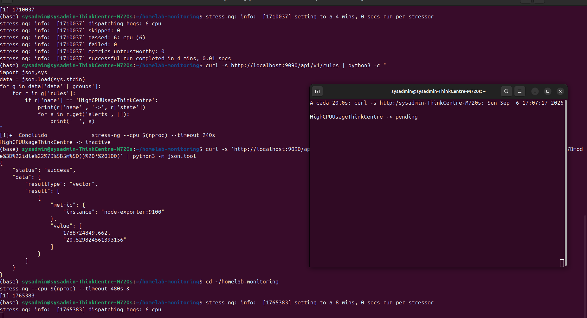
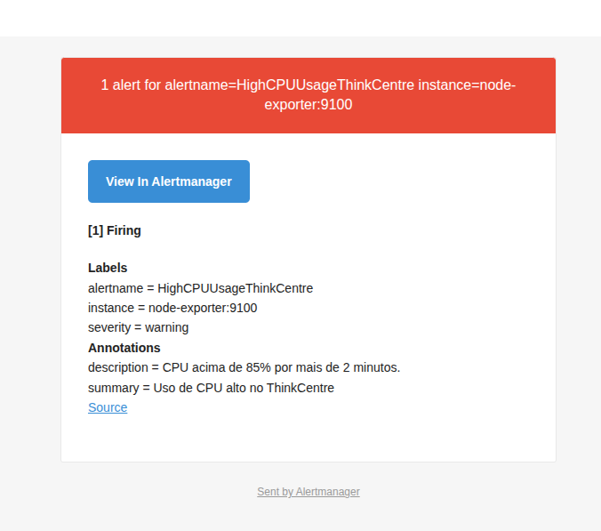
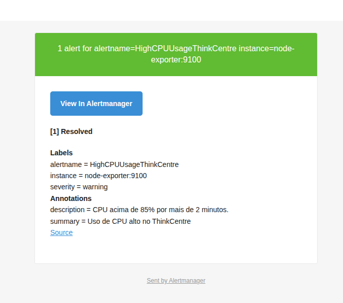

# Runbook — Alertmanager

Registro da integração do Alertmanager ao laboratório de observabilidade, com teste real de ponta a ponta e evidências capturadas.

## Objetivo

Gerar alertas reais a partir das métricas já coletadas pelo Prometheus, entregues em dois canais simultâneos e independentes: e-mail (SMTP) e webhook.

## Componentes adicionados

| Componente | Imagem | Papel |
|---|---|---|
| alertmanager | `prom/alertmanager:latest` | Recebe alertas do Prometheus, agrupa, roteia e envia notificações |
| webhook-receiver | `python:3.11-slim` | Servidor HTTP minimalista (stdlib, sem dependências) que recebe e loga os alertas via webhook, como segunda evidência de entrega |

## Configuração

- `rules.yml`: 3 regras de alerta — `HighCPUUsageThinkCentre` (CPU > 85% por 2min, warning), `HighDiskUsageThinkCentre` (< 15% livre por 5min, warning), `InstanceDown` (up == 0 por 1min, critical)
- `prometheus.yml`: seções `alerting` (aponta para `alertmanager:9093`) e `rule_files` adicionadas
- `alertmanager/alertmanager.yml`: roteamento único (`email-e-webhook`) com dois receivers — `email_configs` (Gmail SMTP, TLS) e `webhook_configs` (local). Inclui `inhibit_rules` para suprimir warning quando já existe critical equivalente

## Decisão de segurança

O arquivo `alertmanager/alertmanager.yml` (com credenciais reais) está no `.gitignore` e nunca é versionado. Apenas `alertmanager/alertmanager.yml.example`, com placeholders, é commitado.

## Troubleshooting durante a implementação

1. **Arquivos de configuração vindos de download apareciam vazios/truncados no `cp`** — causa raiz: fluxo de download do navegador + `cp` manual introduzia falhas silenciosas. Resolvido criando os arquivos diretamente no terminal via heredoc.
2. **Senha de app do Gmail cortada ao usar `sed` com `/` como delimitador** — a senha continha `/`, colidindo com o delimitador padrão do `sed`. Resolvido usando `#` como delimitador e `read -s` para capturar a senha sem expô-la no histórico do shell.
3. **Log do `webhook-receiver` aparecia vazio mesmo com o container `Up`** — causa: buffering padrão do stdout do Python no container, não falha real. Confirmado via teste funcional direto (`curl -X POST` retornando `OK`).
4. **Primeira tentativa de teste (stress-ng de 4min) não disparou o alerta** — a métrica usa `rate(...[5m])`, então a carga precisa se sustentar por mais que a janela de 5min somada aos 2min do `for:`. Corrigido usando `--timeout 480s` (8 minutos).

## Teste real de ponta a ponta

**Método:** carga real de CPU via `stress-ng --cpu $(nproc) --timeout 480s`.

**Resultado observado:**

1. Métrica de CPU ultrapassou 85%.
2. Estado da regra no Prometheus transicionou: `inactive` → `pending` → `firing`.
3. Alerta recebido pelo Alertmanager, com `state: "active"`.
4. E-mail entregue em `veiga.luciano@gmail.com`, com labels e annotations corretos.
5. Webhook entregue e persistido em `webhook-receiver/alerts.log`, com payload completo.
6. Ao cessar a carga, o Alertmanager enviou automaticamente a notificação de **resolução** (e-mail verde "Resolved"), confirmando `send_resolved: true` funcionando de ponta a ponta.

## Evidências

*Estado `pending` da regra `HighCPUUsageThinkCentre`, observado via `watch` sobre `/api/v1/rules`, com a carga real de CPU confirmada via `top`.*

*E-mail recebido com o alerta em estado `firing`, labels e annotations corretos.*

*E-mail recebido automaticamente quando a CPU voltou ao normal,
confirmando o ciclo completo firing -> resolved.*

## Próximos passos

- Testar o alerta InstanceDown (ex: parando o container node-exporter ou snmp-exporter)
- Testar o alerta HighDiskUsageThinkCentre com carga real de disco
- Avançar para a etapa de incidentes controlados (MTTD/MTTR)
