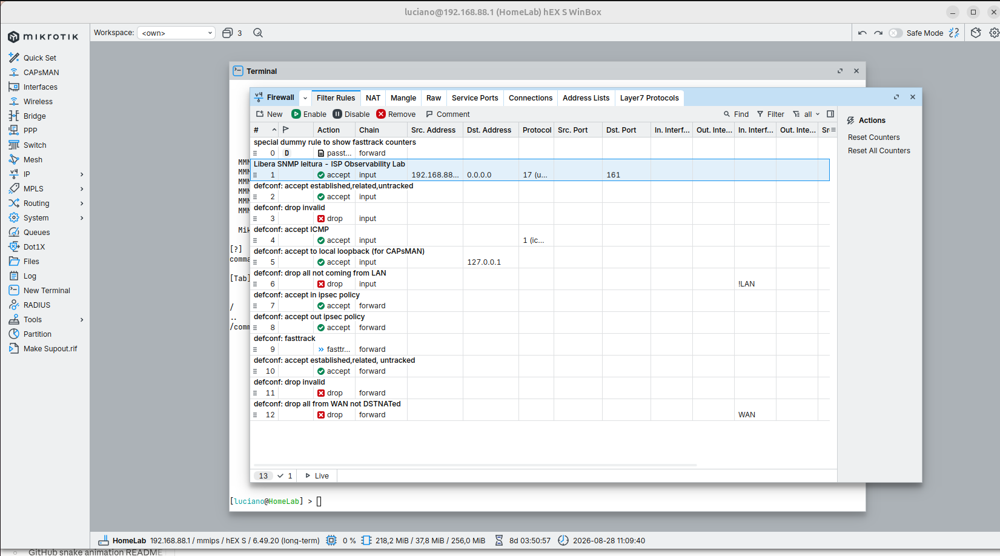
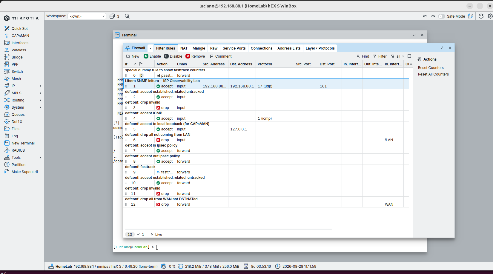
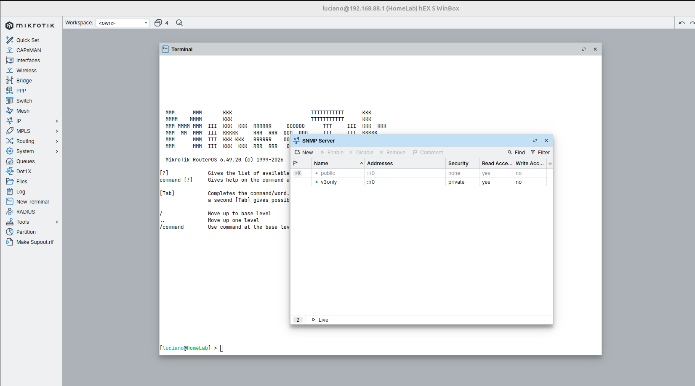
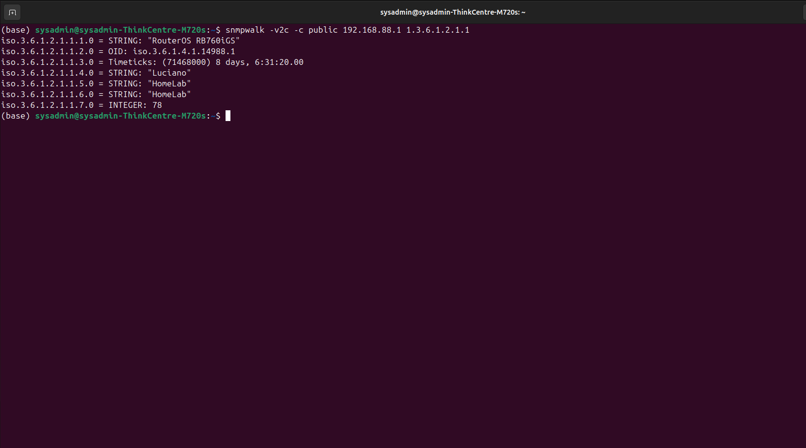

# Runbook: Troubleshooting SNMP no MikroTik

## Contexto

MikroTik hEX S com SNMP habilitado mas sem resposta as consultas do servidor de monitoramento.

## Sintoma

snmpwalk -v2c -c public 192.168.88.1 1.3.6.1.2.1.1
Timeout: No Response from 192.168.88.1

Ping ICMP funcionava normalmente, descartando problema basico de rede.

## Diagnostico

### 1. Conectividade basica

ping -c 4 192.168.88.1

Resultado: OK, 0% de perda. Problema e especifico do SNMP, nao de rede.

### 2. Firewall do MikroTik

Configuracao padrao do MikroTik inclui a regra:

defconf: drop all not coming from LAN (chain=input, action=drop, in-interface-list=!LAN)

Trafego de entrada fora da lista LAN e descartado, incluindo SNMP.

### 3. Regra explicita liberando SNMP

Criada regra de firewall especifica:

- Chain: input
- Protocol: 17 (udp)
- Dst. Port: 161
- Src. Address: 192.168.88.0/24
- Action: accept
- Comment: Libera SNMP leitura - ISP Observability Lab

Importante: a regra precisa ficar ANTES da regra de drop na lista, senao nunca e avaliada.

Evidencia: 

### 4. Ajuste do campo Dst. Address

Na primeira tentativa, o campo Dst. Address ficou com 0.0.0.0, que so daria match se o destino fosse exatamente esse endereco. Corrigido para o IP real do equipamento (192.168.88.1).

Evidencia: 

### 5. Confirmacao de que o pacote batia na regra

Com o contador de Packets visivel no Winbox, confirmado em tempo real que o pacote SNMP era aceito pela regra ao rodar o snmpwalk. Isso descartou o firewall como causa apos o ajuste.

### 6. Causa raiz: community SNMP desabilitada

Em IP > SNMP > Communities, a community "public" estava desabilitada (icone X, texto acinzentado), enquanto "v3only" era a ativa por padrao.

Evidencia: 

## Solucao

1. Selecionar a community "public"
2. Clicar em "Enable"
3. Testar novamente

## Resultado

snmpwalk -v2c -c public 192.168.88.1 1.3.6.1.2.1.1
iso.3.6.1.2.1.1.1.0 = STRING: "RouterOS RB760iGS"
iso.3.6.1.2.1.1.4.0 = STRING: "Luciano"
iso.3.6.1.2.1.1.5.0 = STRING: "HomeLab"

Evidencia: 

## Checklist para proximas ocorrencias

- [ ] SNMP desabilitado globalmente (IP > SNMP > Enabled)
- [ ] Firewall bloqueando porta 161/UDP na chain input
- [ ] Regra de firewall fora de ordem (depois de uma regra de drop)
- [ ] Campo Dst. Address da regra incorreto
- [ ] Community SNMP desabilitada
- [ ] Community com campo Addresses restringindo IPs

## Equipamento de referencia

- Modelo: MikroTik hEX S (RouterOS RB760iGS)
- RouterOS: 6.49.20 (long-term)
- IP de gerencia: 192.168.88.1

## Adendo: integracao com Prometheus via snmp_exporter

Apos validar o SNMP manualmente, o proximo passo foi integrar ao Prometheus via snmp_exporter. Dois problemas adicionais surgiram nesse processo.

### Problema 1: incompatibilidade de versao do snmp.yml

O arquivo snmp_exporter/snmp.yml foi baixado da branch main do projeto, que continha campos novos (enum_values) nao suportados pela imagem prom/snmp-exporter:latest (versao 0.30.1 instalada). O container entrava em crash loop.

Solucao: baixar o snmp.yml da tag correspondente a versao instalada:

curl -o snmp_exporter/snmp.yml https://raw.githubusercontent.com/prometheus/snmp_exporter/v0.30.1/snmp.yml

Licao: sempre baixar arquivos de configuracao gerados a partir de uma tag de versao especifica, nunca da branch main/latest, quando a imagem do container esta fixada em uma versao.

### Problema 2: bind mount nao atualizava apos restart

Apos editar o prometheus.yml adicionando o job mikrotik-snmp, um docker compose restart prometheus nao refletia a mudanca dentro do container (confirmado com docker exec prometheus cat /etc/prometheus/prometheus.yml mostrando o arquivo antigo).

Solucao: recriar o container ao inves de apenas reiniciar o processo:

docker compose down prometheus
docker compose up -d prometheus

Licao: quando uma alteracao em arquivo de configuracao montado via bind mount nao aparece apos restart, testar com down + up antes de investigar hipoteses mais complexas.

### Resultado final

Job mikrotik-snmp confirmado com health up no Prometheus, consultando via proxy snmp-exporter:9116. Integracao validada visualmente no Grafana (Explore) com a metrica ifHCInOctets da interface ether2, mostrando trafego real crescendo ao longo do tempo.

Evidencia: 

## Otimizacao: reducao do snmp.yml

O arquivo snmp_exporter/snmp.yml oficial vem com centenas de modulos para diversos fabricantes (2MB). Como o laboratorio usa apenas o modulo if_mib por enquanto, o arquivo foi reduzido para conter somente esse modulo (34KB), usando um script Python com PyYAML para extrair apenas as chaves auths e modules.if_mib. Reducao de mais de 98% no tamanho do arquivo versionado, sem perda de funcionalidade.
